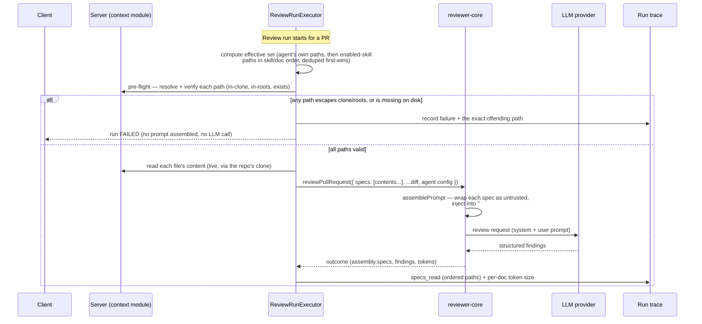

# Spec: Project Context Folder | Spec ID: SPEC-01 | Status: draft
Supersedes: —
Modules: server, client, reviewer-core

## Problem & why

DevDigest already built (L02–L04) the plumbing to ground a review in project markdown —
a `## Project context` prompt slot, an `<untrusted>`-wrapped injection path, and
`specs_read` / `PromptAssembly.specs` trace fields — but nothing populates it: the
review executor never passes `specs`, no server route serves the repo's markdown, and
the client hooks that already target `GET /repos/:repoId/context` have no route to call.

This feature turns a repo's own `specs/`, `docs/`, and `insights/` markdown into
attachable review context: an author manually attaches discovered documents to a review
agent and/or to a skill; at run time the server reads the attached documents fresh from
the repo clone and injects them into the existing prompt slot; the run trace records
exactly what was read and how large it was. It is the bridge to L06, where implementation
will be verified against attached specs before merge.

Full architecture, decisions (Q1–Q7), data flow, and error-handling rationale are in the
approved design:
[`docs/superpowers/specs/2026-07-11-project-context-folder-design.md`](../docs/superpowers/specs/2026-07-11-project-context-folder-design.md).
This spec restates that design as testable, implementation-free acceptance criteria and
resolves four points the design left open — cross-repo attachment scope, eval-harness
parity, kind-badge fallback, and spec-citation verification — as coordinator-confirmed
decisions (see `## Open questions` for the record of each).

## Goals / Non-goals

**Goals**
- Discover every markdown file under `specs/`, `docs/`, `insights/` (any depth) in a
  repo's clone and expose it with its path, size, and last-updated time.
- Let an author manually attach discovered documents to a review agent and to a skill,
  storing paths, not document text.
- At run time, read the effective attached-document set fresh, inject it into the
  existing `## Project context` prompt slot (untrusted-wrapped), and record what was read
  plus its token size in the run trace.
- Introduce zero new LLM calls.
- Demonstrate the live acceptance path: attach a spec describing an invariant, open a PR
  that violates it, and have the reviewer flag it, citing the spec.

**Non-goals (v1)**
- Automatic/"flash" selection of which documents apply to a given PR — attach is manual
  only.
- A vector/embedding index over attached documents — this is attach + inject, not search.
- Enforcing a token budget cap on the effective attached-document set — size is surfaced
  in the trace, not capped.
- Editing document content from within DevDigest — documents are read-only, sourced from
  the repo clone.
- Any change to the `Finding` output contract to add a structured spec-citation field —
  v1 verifies citation via the existing free-text `rationale` only (AC-46); a structured
  citation field is explicitly deferred to L06.
- Per-repo scoping of an agent's/skill's attached-document list — v1 stores one path
  list per agent/skill (workspace-scoped, matching existing agent/skill scoping); that
  list is validated and browsed against the workspace's currently-active repo selection
  (AC-12b, AC-12c) and may not resolve identically against a different repo the same
  agent later reviews (see Edge cases: "Cross-repo attachment mismatch"). True per-repo
  scoping (e.g. separate path lists per repo) is explicit future work, not v1.
- Repo-resolution for the skills A/B evaluation harness — eval runs execute against
  static fixtures with no resolvable repo clone; Project-context injection does not
  apply to them by design (AC-45), and no fixture-to-repo linking is planned in this
  scope.

## User stories

- **US-1** — As an agent author, I attach repo documents to my review agent so its
  reviews are grounded in my team's documented invariants.
- **US-2** — As a skill author, I attach repo documents to my skill so every agent using
  that skill automatically inherits the same grounding context.
- **US-3** — As an agent author, I see which documents my agent inherits from its enabled
  skills, distinct from and read-only alongside the documents I attached directly.
- **US-4** — As the reviewing system, I read the effective attached-document set fresh at
  run time and inject it into the existing review prompt, so findings can cite current
  document content.
- **US-5** — As an agent author, a run fails clearly (not silently) when an attached
  document is missing or invalid at run time, naming exactly which document is at fault.
- **US-6** — As an agent or skill author, I am warned at save time if I attach a path that
  doesn't currently exist, instead of discovering the problem only when a run fails.
- **US-7** — As a security-conscious operator, no attached or requested path can ever
  cause the server to read a file outside the repo clone or outside the allowed root
  folders, including via a symlink.
- **US-8** — As any user, I browse a dedicated Project Context screen listing every
  discovered document for a repo, with filtering and preview, to decide what to attach
  elsewhere.
- **US-9** — As an agent or skill author, I re-run discovery on demand to pick up
  documents added or removed since I last opened the attach picker.
- **US-10** — As anyone reviewing a completed run, I see exactly which documents were read
  and their token size in the run trace, so I can audit what grounded the findings.
- **US-11** — As an agent author, editing my agent's attached documents behaves like any
  other config change: it bumps the agent's version, and replaying an old version reuses
  that version's own attached-path list.
- **US-12** — As an operator, this feature adds zero LLM calls and no enforced token cap
  in v1, so cost and latency stay predictable regardless of how much is attached.
- **US-13** — As a team enforcing an architectural rule, I attach a spec stating the rule
  to my agent; when a PR violates it, the reviewer's finding cites that spec.
- **US-14** — As an agent author running the skills A/B evaluation harness, my agent's
  attached-document configuration does not break or silently corrupt an evaluation run,
  even when the evaluation fixture has no real repo clone to read attachments from.

## Acceptance criteria (EARS)

**Discovery & listing (server reader)**

- AC-1. The system shall discover every file matching the glob pattern
  `**/{specs,docs,insights}/**/*.md` in a repo's clone, at any depth.
  (traces: US-8) (verify: `server/test/context-reader.it.test.ts` — new case asserting
  nested-depth `.md` files under `specs/`, `docs/`, and `insights/` are all discovered)
- AC-2. WHEN a client requests the discovered-document list for a repo, the system SHALL
  respond with each document's path, size, and last-updated timestamp, omitting content.
  (traces: US-8) (verify: `server/test/context-reader.it.test.ts` — "GET
  `/repos/:id/context` list response omits the content field")
- AC-3. WHEN a client requests a single document's content for preview, the system SHALL
  return that content only if the requested path is present in the repo's current
  discovery set. (traces: US-8) (verify: `server/test/context-reader.it.test.ts` — "GET
  `/repos/:id/context/file?path=` returns content for a discovered path")
- AC-4. IF the requested repo has no clone on disk, THEN the system SHALL respond with a
  distinct "repo not cloned" result rather than an empty document list. (traces: US-8)
  (verify: `server/test/context-reader.it.test.ts` — "context list distinguishes
  not-cloned from empty")
- AC-5. IF a repo's clone exists but contains no file matching the discovery pattern,
  THEN the system SHALL respond with an explicit empty list, distinguishable from the
  not-cloned case. (traces: US-8) (verify: same file — "cloned repo with zero matching
  docs returns an empty list, not a not-cloned status")
- AC-6. WHEN an author triggers reindex for a repo, the system SHALL re-run discovery
  against the clone's current state and return the refreshed list, without persisting any
  index record. (traces: US-9) (verify: `server/test/context-reader.it.test.ts` — "POST
  `/repos/:id/context/reindex` reflects a doc added after the prior list call, with no
  DB row written for it")
- AC-7. The discovery walk shall not descend into a symlink that resolves outside the
  repo's clone directory. (traces: US-7) (verify: `server/test/context-reader.it.test.ts`
  — "symlink escaping the clone dir is not discovered")
- AC-8. The set of root folder names eligible for discovery (default `specs`, `docs`,
  `insights`) shall be a server-side configuration value, not hardcoded per call site.
  (traces: US-8) (verify: `rg -n "roots" server/src/platform/config.ts` shows a
  configurable root list; `server/test/context-reader.it.test.ts` — "changing configured
  roots changes the discovered set")

**Attach & storage (agents and skills)**

- AC-9. WHEN an author saves an agent's attached-document list, the system SHALL persist
  the ordered list of paths against that agent. (traces: US-1) (verify:
  `server/test/agents-context-paths.it.test.ts` — "PUT `/agents/:id` persists
  `attached_context_paths` in submitted order")
- AC-10. WHEN an author saves a skill's attached-document list, the system SHALL persist
  the ordered list of paths against that skill. (traces: US-2) (verify:
  `server/test/skills-context-paths.it.test.ts` — "PUT `/skills/:id` persists
  `attached_context_paths` in submitted order")
- AC-11. The order of an attached-document list shall be defined solely by array index,
  and membership solely by presence in the array — no separate ordering or membership
  field exists. (traces: US-1, US-2) (verify: inspect the persisted row shape asserted in
  `server/test/agents-context-paths.it.test.ts` and
  `server/test/skills-context-paths.it.test.ts`)
- AC-12. IF a submitted attached-document list contains a path absent from the current
  discovery set for the governing repo, THEN the system SHALL reject the save with a 422
  response naming the offending path(s). (traces: US-6) (verify:
  `server/test/agents-context-paths.it.test.ts` + `server/test/skills-context-paths.it.test.ts`
  — "PUT rejects an unknown path with 422 naming that path")
- AC-12b. WHEN an author opens an attach-document picker (the agent Context tab's or the
  skill's "Project context to use" section's add-document picker), the system SHALL
  populate it from `GET /repos/:repoId/context` for the workspace's currently-active repo
  selection. (traces: US-1, US-2) (verify: new
  `client/src/app/agents/[id]/_components/AgentEditor/_components/ContextTab/_components/AddContextDocPicker/AddContextDocPicker.test.tsx`,
  mirroring `AddSkillPicker.test.tsx` — "picker requests `GET /repos/:repoId/context` for
  the active repo selection")
- AC-12c. The "governing repo" referenced in AC-12 SHALL be the workspace's
  currently-active repo selection at save time — never an implicit or agent-bound repo.
  (traces: US-6) (verify: `server/test/agents-context-paths.it.test.ts` +
  `server/test/skills-context-paths.it.test.ts` — new case "422 validation resolves the
  governing repo from the active repo selection passed with the request")
- AC-13. IF a submitted attached-document list contains the same path more than once,
  THEN the system SHALL retain only its first occurrence, preserving the order of first
  appearance. (traces: US-1, US-2) (verify: `server/test/agents-context-paths.it.test.ts`
  — "PUT dedupes a repeated path, keeping its first position")
- AC-14. The system shall treat a null, absent, or empty attached-document list
  identically — contributing no Project-context content for that agent or skill.
  (traces: US-1, US-2, US-12) (verify: `server/test/run-executor-context.it.test.ts` —
  "null, absent, and empty `attached_context_paths` all produce an identical run outcome")

**Versioning (agent only)**

- AC-15. WHEN an agent's attached-document list changes, the system SHALL treat the
  change as a config change that increments the agent's version. (traces: US-11) (verify:
  `server/test/agents-versions.it.test.ts` — new case "changing
  `attached_context_paths` bumps the agent version")
- AC-16. The immutable per-version agent config snapshot shall include the
  attached-document list exactly as it existed at save time. (traces: US-11) (verify:
  `server/test/agents-versions.it.test.ts` — "version snapshot config includes
  `attached_context_paths`")
- AC-17. WHEN a run replays a specific past agent version, the system SHALL use that
  version's own snapshotted attached-document list, while resolving each document's file
  content from the current, live repository state. (traces: US-11) (verify:
  `server/test/run-executor-context.it.test.ts` — "replaying an old agent version reads
  its frozen path list with live file contents")

**Skill → agent inheritance**

- AC-18. The effective attached-document set for a run shall be computed as: the agent's
  own attached-document list, in order, followed by the attached-document lists of the
  agent's enabled skills in skill order (each skill's own document order), with any path
  already present earlier in that combined sequence discarded on later appearance.
  (traces: US-3, US-4) (verify: `server/test/run-executor-context.it.test.ts` —
  "effective-set merge: agent-first order, skill order, dedupe keeps first occurrence")
- AC-19. WHEN a skill is disabled for a given agent, the system SHALL exclude that
  skill's attached documents from the effective set used by that agent's runs. (traces:
  US-3) (verify: `server/test/run-executor-context.it.test.ts` — "disabled skill's
  attached docs excluded from the effective set")
- AC-20. WHEN the agent Context tab renders the effective set, the system SHALL visually
  distinguish documents inherited from an enabled skill from the agent's own attached
  documents. (traces: US-3) (verify:
  `client/src/app/agents/[id]/_components/AgentEditor/_components/ContextTab/ContextTab.test.tsx`
  — new, mirroring `SkillsTab.test.tsx` — "inherited docs render visually distinct from
  own docs")
- AC-21. IF a document is inherited from an enabled skill, THEN the agent Context tab
  SHALL NOT allow it to be reordered or removed from that tab. (traces: US-3) (verify:
  same new `ContextTab.test.tsx` — "inherited doc row has no drag handle and no remove
  action")

**Run-time injection & trace**

- AC-22. WHEN a review run begins, the system SHALL compute the effective
  attached-document set for the running agent before assembling the review prompt.
  (traces: US-4) (verify: `server/test/run-executor-context.it.test.ts` — "effective set
  is computed before the LLM call is made")
- AC-23. WHERE the effective attached-document set for a run is non-empty, the system
  SHALL inject each document's content into the existing "Project context" prompt
  section, wrapped as untrusted data, in effective-set order. (traces: US-4) (verify:
  `reviewer-core/test/prompt.test.ts` — extend the existing "Project context" assembly
  case to assert order and `wrapUntrusted` labeling; `server/test/run-executor-context.it.test.ts`
  — "attached documents actually reach `assemblePrompt`")
- AC-24. WHERE the effective attached-document set for a run is empty, the system SHALL
  omit the "Project context" prompt section entirely — no behavior change from today's
  unused slot. (traces: US-4, US-12) (verify: `reviewer-core/test/prompt.test.ts` —
  "empty specs list omits the Project context section")
- AC-25. WHEN a review run completes or fails, the system SHALL record, in the run
  trace's `specs_read` field, the list of document paths actually read, in effective-set
  order. (traces: US-10) (verify: `server/test/run-executor-context.it.test.ts` —
  "`trace.specs_read` matches the effective-set order")
- AC-26. WHEN a document is read for injection, the system SHALL compute and record a
  token-count estimate for that document's content in the run trace. (traces: US-10)
  (verify: `server/test/run-executor-context.it.test.ts` — "trace records a per-document
  token size for each entry in `specs_read`")
- AC-27. The system shall introduce zero additional LLM calls to support context
  discovery, attachment, or injection. (traces: US-12) (verify:
  `rg -n "container\.llm|\.complete\(" server/src/modules/context` returns no matches;
  code-review confirms the context module and the digest-building code path in
  `run-executor.ts` make no LLM adapter calls)
- AC-28. WHERE the effective attached-document set exceeds any practical size, the system
  shall still enforce no maximum token budget in v1; size SHALL only be surfaced for
  observability via the run trace. (traces: US-12) (verify: `reviewer-core/test/prompt.test.ts`
  — "a large combined specs payload is assembled without truncation or rejection")

**Fail-fast pre-flight & security**

- AC-29. WHEN a review run's pre-flight check runs, the system SHALL verify, for every
  path in the effective attached-document set, that it resolves inside the repo's clone
  directory and inside one of the configured discovery roots, before reading any file
  content or invoking the LLM. (traces: US-5, US-7) (verify:
  `server/test/run-executor-context.it.test.ts` — "pre-flight validates every effective
  path before any LLM call")
- AC-30. IF any path in the effective set fails the pre-flight boundary check (escapes
  the clone directory or the configured roots), THEN the system SHALL fail the run
  immediately, naming the exact offending path, without assembling a prompt or invoking
  the LLM. (traces: US-5, US-7) (verify: `server/test/run-executor-context.it.test.ts` —
  "pre-flight fails the run on a traversal path; mock LLM call count is zero")
- AC-31. IF any path in the effective set passes the boundary check but does not exist on
  disk at run time, THEN the system SHALL fail the run immediately, naming the exact
  missing path. (traces: US-5) (verify: `server/test/run-executor-context.it.test.ts` —
  "pre-flight fails the run on a renamed or deleted file")
- AC-32. IF a run fails its pre-flight check, THEN the system SHALL record that failure,
  including the offending path, in the run trace. (traces: US-5, US-10) (verify:
  `server/test/run-executor-context.it.test.ts` — "a failed pre-flight is visible in the
  persisted trace")
- AC-33. The system shall only ever read a path that appears in a discovery pass freshly
  run against the repo's current clone state — a previously valid path is re-verified,
  never trusted from storage alone. (traces: US-7) (verify:
  `server/test/run-executor-context.it.test.ts` — "a path removed from the repo since
  attach time is rejected at run time even though it was valid at save time")
- AC-34. IF a path attempts `../` traversal, an absolute path outside the clone, or a
  symlink escaping the clone directory, THEN the system SHALL reject it at both save time
  and run time, never reading the target. (traces: US-7) (verify:
  `server/test/context-reader.it.test.ts` + `server/test/agents-context-paths.it.test.ts`
  — "a `../../.devdigest/secrets.json`-shaped path is never read, at save or run time")

**Client surfaces**

- AC-35. WHEN an author opens an agent's Context tab, the system SHALL display the
  agent's own attached documents as checked and reorderable, each labeled with a kind
  badge derived from its path. (traces: US-1) (verify: new
  `ContextTab.test.tsx` — "renders own attached docs, checked, with correct kind badges")
- AC-36. WHEN an author reorders the agent's own attached documents in the Context tab,
  the system SHALL persist the new order through the agent update endpoint. (traces:
  US-1) (verify: new `ContextTab.test.tsx` — "drag reorder posts the new
  `attached_context_paths` order", mirroring `SkillsTab.test.tsx`'s reorder case)
- AC-37. WHEN an author opens a skill's editor, the system SHALL display a
  "Project context to use" section supporting the same attach, reorder, and preview
  interactions as the agent Context tab, scoped to that skill. (traces: US-2) (verify:
  `client/src/app/skills/_components/SkillEditor/SkillEditor.test.tsx` — new "Project
  context to use section" case)
- AC-38. WHEN a user navigates to the Project Context screen, the system SHALL list every
  discovered document for the selected repo with a name filter and a preview action.
  (traces: US-8) (verify: new `client/src/app/context/_components/ContextScreen/ContextScreen.test.tsx`,
  mirroring `SkillsListView.test.tsx` — "list renders, filter narrows, preview opens")
- AC-39. WHEN a user selects a document's Preview action in any of the three client
  surfaces, the system SHALL display that document's content read-only. (traces: US-8)
  (verify: shared preview-drawer test, mirroring `SkillPreviewDrawer.test.tsx` — "preview
  shows content with no edit affordance")
- AC-40. IF a previewed document no longer exists at its recorded path, THEN the preview
  SHALL show an explicit "not found" state rather than an empty or broken view. (traces:
  US-6) (verify: shared preview-drawer test — "preview of a stale path shows a not-found
  state, not a blank pane")
- AC-41. WHEN a run trace is viewed, the system SHALL display a "Specs read" panel
  listing each document path actually read for that run alongside its recorded token
  size. (traces: US-10) (verify: `RunTraceDrawer.test.tsx` — new case "Specs read panel
  lists paths and token sizes from `trace.specs_read`")
- AC-42. IF a run's effective attached-document set was empty, THEN the "Specs read"
  panel SHALL show an explicit empty state rather than being omitted from the trace view.
  (traces: US-10) (verify: `RunTraceDrawer.test.tsx` — "empty `specs_read` renders an
  explicit empty state, panel still present")
- AC-43. The kind badge (specs / docs / insights) shall be derived on the client from
  which configured discovery root a document's path falls under, without adding a
  corresponding field to the shared document contract. (traces: US-8) (verify:
  `rg -n "kind" client/src/vendor/shared/contracts/platform.ts` shows no new field on
  `SpecFile`; a client unit test asserts the correct badge label per path prefix)
- AC-43b. IF a document's path falls under a configured discovery root other than the
  three known names (`specs`, `docs`, `insights`), THEN the client SHALL render a generic
  "doc" badge for it, rather than hiding the document or failing to render. (traces:
  US-8) (verify: client badge-derivation unit test — "an unrecognized configured root
  renders a generic 'doc' badge, not a crash or blank")
- AC-44. WHEN the currently-disabled "Project Context" navigation item is enabled, the
  system SHALL route it to the new Project Context screen. (traces: US-8) (verify: client
  nav test — "Project Context nav item is enabled and navigates to `/context`")

**Eval-harness parity**

- AC-45. WHERE an agent used in the skills A/B evaluation harness has an
  attached-document list but the evaluation fixture has no resolvable repo clone, the
  system SHALL run the evaluation without Project-context injection and SHALL NOT fail
  the evaluation because of the unresolved attachment. (traces: US-14) (verify: server
  test for `evaluateSkillsAB` — "an agent with `attached_context_paths` still completes
  an eval run when no repo clone is resolvable, with `specs` omitted from the assembly")

**Live acceptance scenario**

- AC-46. WHEN a PR's diff violates an invariant documented in one of the run's effective
  attached documents, the system SHALL produce a finding whose rationale text references
  that document's content or identity. (traces: US-13) (verify: manual live-check repro
  — attach a spec stating "module `api/` must not import `db/` directly" to a test agent
  for a fixture repo; open a PR whose diff adds such an import; run the agent; confirm
  `trace.specs_read` includes the attached spec's path, and inspect the produced review's
  `finding.rationale` for a reference to the attached spec's content or name)

## Edge cases

- **Empty repo / no docs found** vs **repo not yet cloned** are distinct states (AC-4,
  AC-5) — the client must render two different empty states, not one generic "nothing
  here."
- **Malformed / syntactically-invalid path strings** (empty string, non-`.md` extension,
  null bytes, absolute paths) submitted in a `PUT` body are subsumed by AC-12 and AC-34:
  the whitelist check ("must be present in the current discovery set") rejects anything
  that isn't a real, in-bounds, discovered `.md` file — no separate malformed-string
  parser is required.
- **Duplicate paths** within a single submitted list (AC-13) and **duplicate paths across
  agent-own vs inherited-skill lists** (AC-18) are handled by two different, complementary
  dedupe rules — first-occurrence-wins in both cases, but at different merge stages. An
  implementer must not conflate them into a single dedupe pass.
- **Stale path discovered between save and run** (a file renamed or deleted after
  attach-time validation passed) — AC-31 fails the run; this is the expected, common case
  the design explicitly favors strictness for (see design's Risks & tradeoffs).
  Contributors should not "fix" this by silently skipping the missing document — see
  Non-goals.
- **A repo with a very large number of matching documents** — AC-1/AC-28 impose no cap;
  large sets are a known v1 performance limitation (see `## Non-functional`), not a
  correctness bug.
- **Concurrent edits to the same agent's/skill's attached-document list** — this reuses
  the agent/skill update endpoint's existing concurrency behavior (last write wins); no
  new corner case is introduced by this feature.
- **Cross-repo attachment mismatch** — an agent's or skill's attached documents are
  browsed and validated against the workspace's currently-active repo selection at attach
  time (AC-12b, AC-12c), but the same agent may later run against a PR from a different
  repo in the workspace. Attachment paths are resolved per-run against the PR's own repo
  (unchanged from the original design; run-executor already derives `repoId` from
  `pull.repoId`), so cross-repo attachment is supported only insofar as the identical
  relative path also exists in the run's target repo. When it doesn't, the run fails via
  the existing missing-path pre-flight (AC-31) — expected, by-design behavior, not a bug.
  True per-repo scoping of an agent's/skill's attachments (e.g. a separate path list per
  repo) is explicit future work — see Non-goals.

## Non-functional

- **Security.** Path-traversal and symlink-escape rejection (AC-7, AC-30, AC-33, AC-34)
  is a MUST, enforced identically at save time and run time. No attached or requested
  path may ever resolve outside a repo's own clone directory or outside the configured
  discovery roots, regardless of syntactic form.
- **Performance.** On-demand, stateless glob discovery is accepted as a v1 cost; no
  formal latency budget is set for `GET /repos/:repoId/context` or the pre-flight check.
  A persisted index is the documented future upgrade if this becomes a bottleneck on
  large repos — out of scope here.
- **Cost.** Zero new LLM calls (AC-27); no token-budget cap enforced (AC-28) — size is an
  observability signal only in v1.
- **Accessibility.** The Context tab's and skill section's reorder interaction reuses the
  existing sortable-list pattern (drag handle + keyboard operability) already established
  for the agent Skills tab — the same keyboard-accessible affordance is required here, not
  a degraded mouse-only variant.
- **Observability.** Every run — success or pre-flight failure — must leave a trace
  record sufficient to answer "what document(s) did this run read, and how big were
  they" (AC-25, AC-26, AC-32) without needing to reproduce the run.

## Interfaces & flows

**Data shapes** (existing `SpecFile` contract, unchanged; two new persisted fields)

| Name | Shape | Notes |
|---|---|---|
| `SpecFile` (existing) | `{ path: string, content?: string \| null, size?: number \| null, updated_at?: string \| null }` | List responses omit `content`; the single-file endpoint populates it. No new field added (`kind` is client-derived, per AC-43). |
| `attached_context_paths` (new, on `Agent` and `Skill` DTOs) | `string[] \| null` | Order = array index; membership = presence. Mirrors the existing `Skill.evidence_files` shape, but — unlike `evidence_files` — is read live from disk at run time, not a static citation trail. |
| `AgentVersionConfig` (extended) | adds `attached_context_paths: string[]` to the existing immutable per-version snapshot fields | Frozen at version-bump time (AC-16). |
| `RunTrace.specs_read` (existing field, newly populated) | `string[]` | Ordered to match the effective set (AC-25). |
| `PromptAssembly.specs` (existing field, newly populated) | `string \| null` | Already flows from `outcome.assembly`; this feature is the first producer. |

**Endpoints in scope**

| Endpoint | Purpose | Key behavior |
|---|---|---|
| `GET /repos/:repoId/context` | List discovered documents for a repo | AC-1, AC-2, AC-4, AC-5, AC-8 |
| `GET /repos/:repoId/context/file?path=` | Single document content, for preview | AC-3, whitelisted against discovery set |
| `POST /repos/:repoId/context/reindex` | Re-glob and return the fresh list | AC-6; no persistence |
| `PUT /agents/:id` (extended) | Accepts `attached_context_paths` | AC-9, AC-12, AC-13, AC-15 |
| `PUT /skills/:id` (extended) | Accepts `attached_context_paths` | AC-10, AC-12, AC-13 |

**Attach-time flow (author)**

1. Client requests the discovered-document list for the workspace's currently-active
   repo selection (AC-12b).
2. Author toggles/reorders documents in the agent Context tab, the skill's "Project
   context to use" section, or browses via the Project Context screen.
3. Client submits the ordered path list via `PUT /agents/:id` or `PUT /skills/:id`.
4. Server validates each path against a freshly-computed discovery set for the governing
   repo — the same active repo selection (AC-12c); unknown paths → 422 (AC-12);
   duplicates deduped (AC-13).
5. On success, an agent's version bumps if the path list changed (AC-15); the immutable
   snapshot captures the new list (AC-16).

**Run-time flow**

**Skill inheritance merge (AC-18)** — effective set = `agent.attached_context_paths` (in
order) concatenated with, for each of the agent's *enabled* skills in skill order, that
skill's own `attached_context_paths` (in its own order); the combined sequence is then
deduped by path, keeping only the first occurrence.

## Inputs (provenance)

- [reused: L02–L04] The `## Project context` prompt slot, `wrapUntrusted` +
  `INJECTION_GUARD`, `PromptAssembly.specs`, and `RunTrace.specs_read` all already exist
  and are unused; this spec is their first producer, not a new contract.
- [reused: existing pattern] The hand-rolled directory-walk approach already used by
  `adapters/codeindex/ripgrep.ts`'s `walk` recursion — reused for discovery, no new glob
  dependency introduced.
- [reused: existing pattern] Storage mirrors `Skill.evidence_files` (jsonb `string[]`,
  nullable, no default) and the existing agent-versioning / `AgentVersionConfig` /
  `isConfigChange` machinery.
- [deterministic: no LLM] Discovery, validation, pre-flight, merge/dedupe, and token
  counting are all deterministic server-side computation — zero LLM calls (AC-27).
- [new: 0 LLM calls] This feature adds no new model invocations anywhere in its own
  code paths; it only causes the *existing* review call to receive a populated `specs`
  argument it previously always received as empty.

## Untrusted inputs

Two distinct untrusted-input boundaries apply here:

1. **Document content.** Every attached document's file content is read from the repo
   clone and is therefore repo-write-access-controlled, third-party text — anyone able to
   open a PR or push to the branches this content is read from can shape it. It MUST be
   (and already is, per the reused L02–L04 machinery) treated as data to analyze, never
   as instructions: wrapped via `wrapUntrusted` and covered by the existing
   `INJECTION_GUARD` appended to the system prompt (`reviewer-core/src/prompt.ts`). This
   spec does not weaken, replace, or duplicate that guard — it is the sole defense, reused
   as-is, for this new content type exactly as it already is for the diff and PR
   description.
2. **Attached path strings.** The `attached_context_paths` array in a `PUT` body is
   client-supplied and must never be trusted as a safe filesystem reference merely
   because it looks like a relative path — it is validated (whitelisted against a fresh
   discovery set, checked against clone/root boundaries) at both save time and run time,
   per AC-12, AC-30, AC-33, AC-34. This is an identifier-safety boundary, separate from
   the content-safety boundary above.

## Traceability

| AC-id | US-id | module | task-id |
|---|---|---|---|
| AC-1 | US-8 | server | — |
| AC-2 | US-8 | server | — |
| AC-3 | US-8 | server | — |
| AC-4 | US-8 | server | — |
| AC-5 | US-8 | server | — |
| AC-6 | US-9 | server | — |
| AC-7 | US-7 | server | — |
| AC-8 | US-8 | server | — |
| AC-9 | US-1 | server | — |
| AC-10 | US-2 | server | — |
| AC-11 | US-1, US-2 | server | — |
| AC-12 | US-6 | server | — |
| AC-12b | US-1, US-2 | client | — |
| AC-12c | US-6 | server | — |
| AC-13 | US-1, US-2 | server | — |
| AC-14 | US-1, US-2, US-12 | server | — |
| AC-15 | US-11 | server | — |
| AC-16 | US-11 | server | — |
| AC-17 | US-11 | server | — |
| AC-18 | US-3, US-4 | server | — |
| AC-19 | US-3 | server | — |
| AC-20 | US-3 | client | — |
| AC-21 | US-3 | client | — |
| AC-22 | US-4 | server | — |
| AC-23 | US-4 | reviewer-core | — |
| AC-24 | US-4, US-12 | reviewer-core | — |
| AC-25 | US-10 | server | — |
| AC-26 | US-10 | server | — |
| AC-27 | US-12 | server | — |
| AC-28 | US-12 | reviewer-core | — |
| AC-29 | US-5, US-7 | server | — |
| AC-30 | US-5, US-7 | server | — |
| AC-31 | US-5 | server | — |
| AC-32 | US-5, US-10 | server | — |
| AC-33 | US-7 | server | — |
| AC-34 | US-7 | server | — |
| AC-35 | US-1 | client | — |
| AC-36 | US-1 | client | — |
| AC-37 | US-2 | client | — |
| AC-38 | US-8 | client | — |
| AC-39 | US-8 | client | — |
| AC-40 | US-6 | client | — |
| AC-41 | US-10 | client | — |
| AC-42 | US-10 | client | — |
| AC-43 | US-8 | client | — |
| AC-43b | US-8 | client | — |
| AC-44 | US-8 | client | — |
| AC-45 | US-14 | server | — |
| AC-46 | US-13 | server, reviewer-core | — |

## Open questions

All four ambiguities surfaced during the design-analysis pass have been resolved
(coordinator-confirmed, 2026-07-11). No open points remain; recorded here for
traceability, each pointing at where the resolution now lives in this spec.

1. **Cross-repo attach — resolved.** Attached paths are resolved per-run against the
   repo of the reviewed PR (unchanged from the original design; `run-executor.ts`
   already derives `repoId` from `pull.repoId` — AC-29..AC-33). No `repo_id` column is
   added to `agents`/`skills`; both stay workspace-scoped. The attach picker and
   save-time validation instead resolve against the workspace's currently-active repo
   selection (AC-12b, AC-12c). Consequence, stated as an edge case: if an agent is
   attached to a path that doesn't exist in the repo of a PR it runs against, the run
   fails via the existing missing-path pre-flight (AC-31) — see Edge cases,
   "Cross-repo attachment mismatch." True per-repo scoping of attachments is explicit
   future work, not v1 (see Non-goals).
2. **Eval-harness parity — resolved.** The skills A/B eval harness runs against static
   fixtures with no repo clone. Eval-harness runs execute without Project-context
   injection and must not fail due to absent/missing project context (AC-45, unchanged
   as the governing criterion). "Parity with the run-executor digest" does not apply to
   fixture-based eval runs — only real repo-backed review runs perform injection; see
   Non-goals.
3. **Kind badge — resolved.** The client derives the badge from the discovery root a
   path matches. The three known roots (specs/docs/insights) map to their named badge
   (AC-43). A path under a reconfigured root outside those three names renders a
   generic "doc" badge (AC-43b) — never a crash or a hidden document.
4. **Citing the spec — resolved.** v1 verifies "the reviewer cites the spec" by
   inspecting the finding's free-text `rationale` (AC-46, unchanged) — the `Finding`
   contract has no structured citation field today, and this is the intended v1
   verification method, matching the design's own manual live-check framing. A
   structured citation field is explicitly deferred to L06 (see Non-goals).

## Self-check

- **Placeholder scan** — pass. No `TBD`/`TODO`/`<fill in>`/`NEEDS CLARIFICATION` remains
  anywhere in the document; all four former open points are resolved decisions recorded
  in `## Open questions` with pointers to the ACs/Non-goals bullets that capture them.
- **EARS-testability** — pass. Every AC-1..AC-46, plus AC-12b, AC-12c, and AC-43b added
  to convert the four resolved open questions into criteria, matches exactly one of the
  five patterns (ubiquitous / event-driven / state-driven / unwanted-behavior /
  optional-feature) with a single trigger and a single testable response; compound "and
  also" responses were split out during drafting (e.g. the original combined
  inherited-doc AC was split into AC-20 "visually distinguish" and AC-21 "not
  reorderable/removable"; the cross-repo resolution was split into AC-12b "picker source"
  and AC-12c "validation source" rather than one compound criterion).
- **Traceability** — pass. Every AC carries an inline `(traces: US-x)` tag; every
  US-1..US-14 is covered by at least one AC (checked by hand against the Traceability
  table); the table uses only the three header-declared module names.
- **Verification** — pass. Every AC carries a concrete `(verify: …)` hint — a named test
  file + case (existing or clearly-marked "new, mirroring X"), a `rg` inspection command,
  or (AC-46 only) an explicit manual repro sequence, matching the design's own "Live
  check" framing for that scenario.
- **Consistency** — pass. The header's `Modules: server, client, reviewer-core` matches
  every module referenced in `## Interfaces & flows` and in the Traceability table; no AC
  references a module outside that set.
- **Scope** — pass. Goals and Non-goals are both populated; no AC exceeds what Goals
  declares (auto-select, vector indexing, token caps, and doc editing are explicitly
  excluded in Non-goals and no AC contradicts that).
- **Ambiguity** — pass. No vague verbs ("work fine," "handle gracefully," "as needed")
  remain unresolved in any AC; the four genuine ambiguities found during the
  design-analysis pass were confirmed and resolved by the coordinator and converted into
  AC-12b/AC-12c, AC-43b, an Edge cases rewrite, and Non-goals notes — none remain open.
- **Untrusted inputs** — pass. Section names both boundaries explicitly (document
  content vs. attached path strings) with the exact reused defense and the exact new
  validation, rather than a generic "—".
- **No implementation detail** — pass. No code, function names, or variable names appear;
  `## Interfaces & flows` contains only a data-shape table, an endpoint table, a mermaid
  sequence diagram, and a merge-rule description — all describing contracts, not bodies.
- **Open questions are explicit** — pass. All four previously-open points are now
  resolved decisions, each recorded in `## Open questions` with a pointer to the AC,
  Edge case, or Non-goals bullet that captures it; no unresolved
  `[NEEDS CLARIFICATION: …]` marker remains anywhere in the document.
